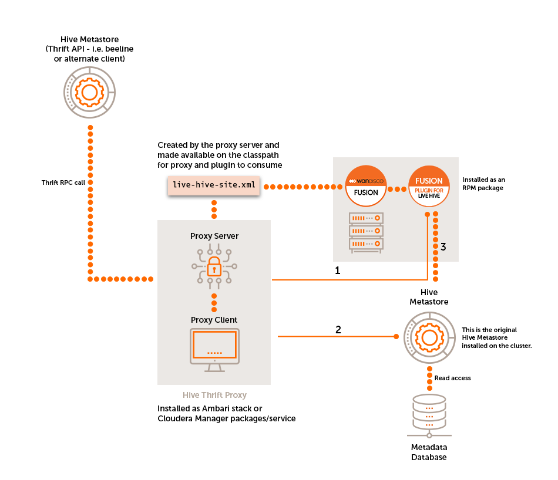

## Fusion Plugin for Live Hive Overview

WANdisco Fusion provides a method of replicating Hive metadata with the Fusion Plugin for Live Hive. The deployment of this plugin includes the installation of the Live Hive plugin and the Live Hive proxy.

The Live Hive Proxy service coordinates actions performed by client applications that interact with the Hive Metastore. This could either be directly using its thrift interface, or indirectly via another client application (such as [Beeline](https://cwiki.apache.org/confluence/display/Hive/HiveServer2+Clients#HiveServer2Clients-Beeline%E2%80%93CommandLineShell)).

The Live Hive Proxy passes on read commands directly to the local Hive Metastore, and coordinates any write commands with the Fusion Plugin for Live Hive, so all metastores on all environments within the replicated ecosystem will perform the write operations (e.g. database/table creation).

Live Hive will automatically start to replicate Hive databases and tables when their names match a user defined rule. This must also include a matching HCFS rule for the underlying filesystem data of the database/table.

1. Write access needs to be coordinated by Fusion before executing the command on the Hive Metastore.
1. Read commands are 'passed-through' straight to the Hive Metastore as they do not need to be coordinated via Fusion.
1. Fusion makes a connection to the Hive Metastore on the cluster and coordinates any write requests with the rest of the replicated ecosystem.
